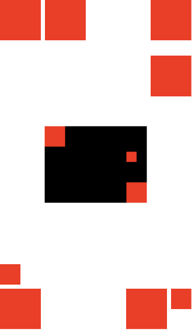

<p align="center">
    
</p>

<p align="center">
    
    <a href="https://swift.org/package-manager">
        
    </a>
    <a href="https://twitter.com/filiplazov">
        
    </a>
</p>


CornerStacks provides an easy way to layout SwiftUI views at the 4 corners of the parent view. It works by wrapping `HStack` and `VStack`, with a straightforward implementation combining both `HStack` and `VStack` along with some `Spacer`s to produce the desired layout for each of the corner views. The primary purpose is to reduce boilerplate setup, increase code readability and allow for rapid prototyping. This layout technique is nicely explained by John Sundell in [this video](https://www.youtube.com/watch?v=XC5NOBsHcf0).

## Requirements

- iOS 13.0+ / macOS 10.15+ / tvOS 13.0+ / watchOS 6.0+
- Xcode 11.0+
- Swift 5.1+


## Installation

I . Automatically in Xcode:

 - Click **File > Swift Packages > Add Package Dependency...**  
 - Use the package URL `https://github.com/filiplazov/CornerStacks` to add CornerStacks to your project.

II . Manually in your **Package.swift** file add:

```swift
.package(url: "https://github.com/filiplazov/CornerStacks", from: "0.1.0")
```

## Usage

Before using any of the views make sure you import the `CornerStacks` module 

```swift
import CornerStacks
```

There are 4 views defined for both `HSTack` and `VStack` that represent the 4 corners.

**HStack**

- `TopLeadingHStack`
- `TopTrailingHStack`
- `BottomLeadingHStack`
- `BottomTrailingHStack`

**VStack**

- `TopLeadingVStack`
- `TopTrailingVStack`
- `BottomLeadingVStack`
- `BottomTrailingVStack`

**Example**

It is much easier to explain in an example

```swift
var body: some View {
  ZStack {
    // just like a normal HStack you can place many nested views
    TopLeadingHStack {
      makeSquare(size: 80)
      makeSquare(size: 80)
    }
    // spacing is passed along to the wrapped HStack and VStack
    TopTrailingVStack(spacing: 30) {
      makeSquare(size: 80)
      makeSquare(size: 80)
    }
    // horizontal alignment is passed along to the wrapped VStack
    BottomLeadingVStack(alignment: .leading) {
      makeSquare(size: 40)
      makeSquare(size: 80)
    }
    // vertical alignment passed along to the wrapped VStack
    BottomTrailingHStack(alignment: .top) {
      makeSquare(size: 80)
      makeSquare(size: 40)
    }
    // it works also in nested views like other VStacks and HStacks
    HStack {
      TopLeadingHStack {
        makeSquare(size: 40)
      }
      BottomTrailingVStack {
        makeSquare(size: 40)
        makeSquare(size: 40)
      }
    }
    .frame(width: 200, height: 150)
    .background(Color.black)
  }
}
```
Here is the output from the code above

<p align="center">
    
</p>

## Contributing

Contributions are more than welcome. Please create a GitHub issue before submitting a pull request to plan and discuss implementation.

## Author
* [Filip Lazov](https://github.com/filiplazov) ([@filiplazov](https://twitter.com/filiplazov))

## License

CornerStacks is available under the MIT license. See the [LICENSE](LICENSE) file for more info.
